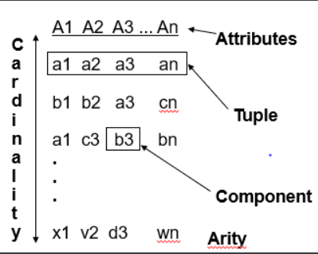
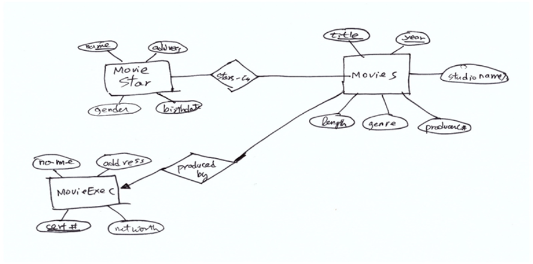
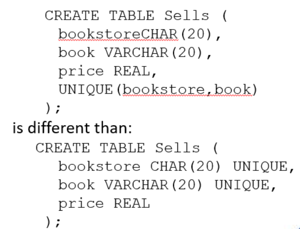
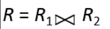
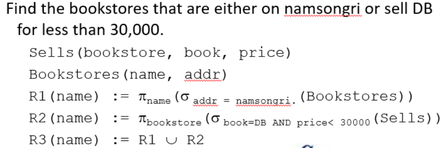

## CH.2: The Relational  Model of Data

------------

### 2-2. Basics of the Relational Data Model

Relation = Table

Attributes = Column headers(맨 위에 있는 것)

Tuple = Row

Instance : Row에 있는 data들.

Component : data

Domain: data type(int, char등)

### 2-3. Defining a Relation Schema in SQL

Table 은 결과를 저장, View는 과정을 저장.

**E/R Diagram**

* Square : Entity(table)
* Diamond: Relationship between entity
* Oval: Attribute
* Multiplicity Relationship(M:M, M:1, 1:1)
* Arrow: M:1일때(Many to 1) 화살표가 가리키는 곳이 1

**Declaring Keys**

* *Primary Key*: 테이블에 최대 1개 있을 수 있고, `primary key`로 지정된 것은 unique해야 하며 null이 허용되지 않음. 즉, 중복되는 값이 없어야 함.

* Unique Key: null이 허용되는 `primary key`

* EX) Table에 서점, 책, 가격의 attribute가 있고 primary key로 서점, 책이 설정 되었을 경우

  Pohang, DB, 24000 (O), Handong, DB, 30000 (O), Pohang, DB, 30000 (X) - pohang, db는 이미 24000이라는 고유의 값을 가지고 있기 때문에 중복되면 안됨.

  

  Unique(bookstore, book)일 경우 (Pohang, DB), 24000와 (Handong, DB), 30000은 다르지만

  밑에거는 Pohang, DB, 24000과 Handong, DB, 30000은 불가능

* Primary Key의 장점: 수많은 데이터에서 원하는 table의 데이터로 접근할 수 있게 도와줌.

### 2-4. An Algebraic Query Language

Algebra: How to compute

Decomposition: 분해

**Relational Algebra** [관계연산자 예시](<http://www.engr.sjsu.edu/fayad/current.courses/cmpe226-fall07/docs/lecture6/03-RA-Examples3.pdf>)

- Projection
  원하는 key를 선택해서 사용.(column)

  $$
  R_1 = \pi_L(R_2)
  $$

- Selection
  $$
  R_1 = \sigma_c(R_2)
  $$
  원하는 데이터를 선택해서 사용(row)

- Cartesian Product
  $$
  R = R_1 X R_2
  $$
  모든 tuple을 서로 곱함. set의 곱과 똑같음.

- Natural Join

  

  R1과 R2를 서로 연결해서 R이라는 새로운 table을 생성.

- Theta Join

  

  C는 여기서 조건에 해당. 조건을 만족하는 애들만 Cartesian Product를 실행. 아래식과 동일
  $$
  R = \sigma_c(R_1 X R_2)
  $$

- Renaming
  $$
  \rho_{S(A_1,...,A_n)}(R)
  $$
  R에 있는 attribute들의 이름을 A1, A2, ... , An 으로 바꿈

- Union, Intersection, Difference : set과 동일

- 연산자 우선순위

  1. Selection, Projection, Rename
  2. Natural join, Theta join, Cartesian product
  3. Union, Intersection, Difference

- Linear Notation for Expression

  algebraic expression을 이용해 새로운 relation을 만듬.

### 2.5 Constraints on Relation

**Referential Integrity Constraints**

Relation에 있는 value가 다른 relation에도 있다면 두 relation은 서로 관계가 있다. 어떤 relation A의 tuple이 다른 Relation B의 tuple을 참조하려면 그 tuple은 Relation B 내에 존재해야 한다.

Relation이 주어지면 그 Relation에 value는 적어도 하나는 존재해야 한다.

* 동그란 화살표 = exact one, 그냥 화살표 = zero도 가능
* 위의 관계는 둘 다 동그란 화살표 = one to one
* 이 그림에서는 서로 primary key가 연결되어 있는데 하나의 relation을 지우려면 연관되어 있는 다른 한쪽 역시 지워야만 함. M이 존재하기 위해서는 F가 있어야만 하기 때문.

**Key Constraints**

서로 다른 tuple은 동일한 key attribute를 가지면 안된다. name과 address라는 attribute가 있을 때, tuple의 name이 같으면 address도 같아야 한다.

**Additional Constraints**

사용자 지정 제약

### 요약(?)

**Schema**

* How to create table

**Expression**

* How to express query linear algebra

* How to express relational algebra

**Constraints**

* How to setting the constraint

  * Relation integrity Constraint

    table이 주어지면 그 table의 value는 적어도 하나는 있어야함.

  * Key Constraint

  * Additional Constraint

[수식정리](https://en.wikipedia.org/wiki/Help:Displaying_a_formula#Formatting_using_TeX)

### Question

Foregin key